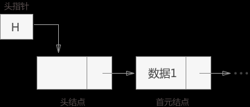

## 第二章 线性结构
###2.1 线性表
#### 定义
是零个或多个元素的有穷序列，通常可以表示为k0，k1...，kn-1(n>=1)
表头，表尾，前驱，后驱
####特点
1，均匀性，同一线性表的各元素有相同的数据类型和长度
2，有序性，各元素在表中都有自己的位置。
####分类
1. 按复杂程度分：
    - 简单的：线性表，栈，队列，散列表
    - 高级的：广义表，多维数据，文件...
2. 按访问方式分：
    - 直接访问型 
    - 顺序访问型 
    - 目录访问型 
#####1.1. 线性表
分为顺序表和链表，链表分为：单链表，双链表，循环链表
######1.1.1 顺序表
######定义
也称向量，采用定长的一维数组存储结构
2） 主要特性
 - 元素类型相同
 - 元素的顺序地存储在连续的存储空间中，每个元素有唯一的索引值
 - 使用常数作为向量的长度
3）算法分析：
   最好情况：在表尾插入，时间复杂度 O(1)
   最坏情况：在表头插入，时间复杂度 O(n)
   平均情况：时间复杂度 O(n)
4）思考
   顺序表中，插入和删除要考虑哪些问题？
   顺序表有哪些优缺点？
######1.1.2 链表
1) 定义：通过指针把它的一串存储节点链成一个链
   存储节点由两部分组成：数据域（data）+指针域,也叫后继地址(next)。
   节点：链表中的节点又分为头节点、首元节点和其他节点
2）分类
  1. 单链表（single linked list）（指针指向自己的直接后继元素）：
   单向链表只有一个方向，结点只有一个后继指针 next 指向后面的节点，链表这种数据结构通常在物理内存上是不连续的。
   我们习惯性地把第一个结点叫作头结点，链表通常有一个不保存任何值的 head 节点(头结点)，通过头结点我们可以遍历整个链表。尾结点通常指向 null
  2. 双链表（指针指向自己的直接后继元素和直接前驱元素）
   循环单链表（指针指向自己的直接后继元素，表尾节点的指针指向头节点）
   循环双链表（指针指向自己的直接后继元素和直接前驱元素，表尾节点的指针指向头节点）
3）引入头节点的优点：

      
 4） 思考
 带表头与不带表头的单链表？
 处理链表需要注意哪些问题？

